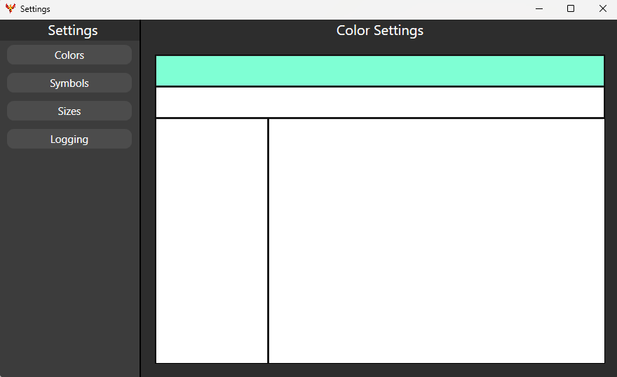
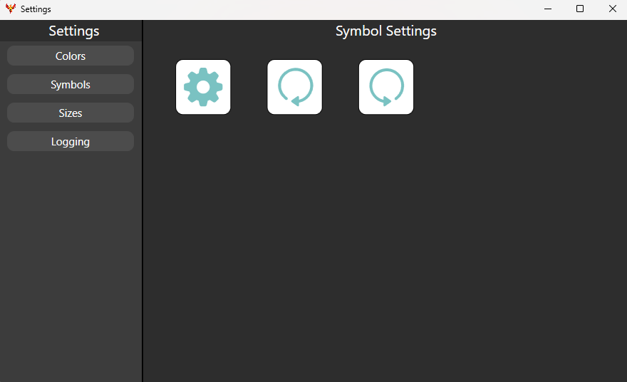
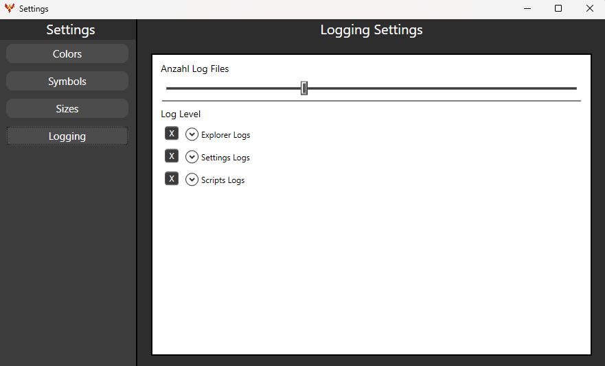
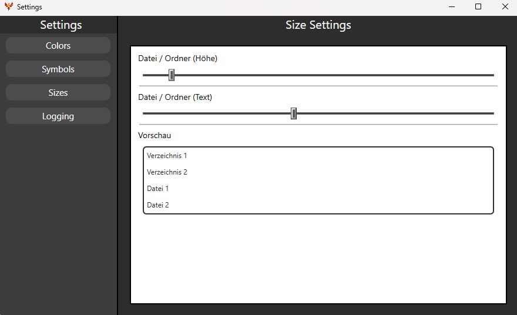
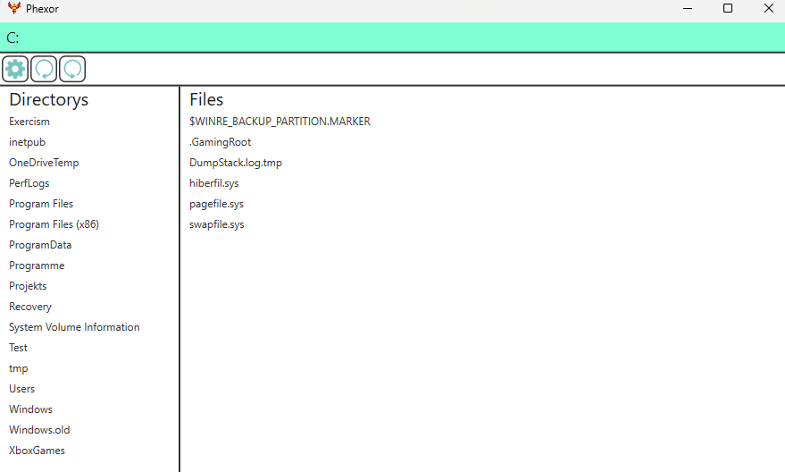

  

    
    
    
    
    
    
    
    
    
    
    

---

# 🌟 About Phexor

- **Phexor** is an open-source file explorer.  
- 🛠️ Its main goal is to achieve a high level of user-friendliness.  
- 🎨 The GUI is completely customizable.  
- ❌ Unnecessary features are not activated by default.  
- ⚙️ Additional features can be activated in the [Settings menu](https://github.com/kallioderso/Phexor/tree/master?tab=readme-ov-file#settingsmenu).  
- ⌨️ A few [Shortcuts](https://github.com/kallioderso/Phexor/tree/master?tab=readme-ov-file#shortcuts) are available for extra modes.  
- 💡 Ideas can be shared by creating an [Issue](https://github.com/kallioderso/Phexor/issues).  
- 📜 All actions are [Logged](https://github.com/kallioderso/Phexor?tab=readme-ov-file#logging) to identify errors easily.  
- 🔒 Personal data like directory or file names are not logged to protect privacy.  

---

# 📝 Notes

- **Phexor is currently in the Alpha stage due to a remake.**  
  - **Reasons for the remake:**  
    *The old version was not user-friendly enough due to its design.*  
- ⏳ Please understand that I have limited time to work on Phexor because of school and my search for a mini job, but I try to work on it as much as I can.  

---

# 🚀 Features

### ✅ **Existing Features**
- 🖱️ Scrolling with mouse and keyboard.  
- 🎨 Customizable GUI elements.  
- 🧩 Simple and intuitive GUI.  
- 🔗 Multiple methods for path input.  
- ⌨️ [Shortcuts](https://github.com/kallioderso/Phexor?tab=readme-ov-file#shortcuts).  
- 📜 [Logging](https://github.com/kallioderso/Phexor?tab=readme-ov-file#logging).  
- ⚙️ Settings for file and folder appearance.  

### 🔜 **Upcoming Features**
- 📂 Creating menus for files and folders.  
- 🌟 Including community ideas.  

### ❌ **Removed Features**
- 📖 Tutorial.  
- 🖱️ 3-mode scrolling.  
- 🖼️ File images.  

---

# ⌨️ Shortcuts

### 🅿️ **Placeholders (P)** *(Coming back soon)*  
- Activate by pressing *P*.  
- Useful for identifying file images.  

### 🅸 **Input Field (I)**  
- Activate by clicking or pressing *I*.  
- Allows interaction with mouse or keyboard.  

### ⏎ **Enter Paths (Enter)**  
- Enter paths by pressing *Enter*.  

### ⚙️ **Settings (S)**  
- Open the [Settings menu](https://github.com/kallioderso/Phexor?tab=readme-ov-file#settingsmenu) by clicking or pressing *S*.  

### ↩️ **Undo (U)**  
- Undo by clicking or pressing *U*.  

### ↪️ **Redo (R)**  
- Redo by clicking or pressing *R*.  

### ❌ **Escape (ESC)**  
- Exit path input by pressing *ESC*.  

### 📂 **Directorys (D)** *(Coming back soon)*  
- Select directories by pressing *D*.  

### 📄 **Files (F)** *(Coming back soon)*  
- Select files by pressing *F*.  

### ⬆️ **Up (˄)** *(Coming back soon)*  
- Scroll up by pressing *˄*.  

### ⬇️ **Down (˅)** *(Coming back soon)*  
- Scroll down by pressing *˅*.  

---

# 📜 Logging

- **Logging** helps identify bugs or problems by providing detailed logs.  
- 🗂️ Logs are located at `%AppData%\Roaming\Phexor\Logs\`.  
- ⚙️ The number and type of logs can be configured in the settings.  

### **Log Types**

#### **Explorer Logs**
- Logs actions related to file and folder exploration.  
  - `00:00:00 [MainWindow] : Colorize`  
  - `00:00:00 [MainWindow] : StartPathSearch`  
  - `00:00:00 [MainWindow] : DirectoryScrolling`  
  - `00:00:00 [MainWindow] : FileScrolling`  
  - `00:00:00 [MainWindow] : OpenSettings`  
  - `00:00:00 [MainWindow] : OpenDirectory`  
  - `00:00:00 [MainWindow] : OpenFile`  
  - `00:00:00 [MainWindow] : Undo`  
  - `00:00:00 [MainWindow] : Redo`  
  - `00:00:00 [MainWindow] : OpenFieldPopup`  
  - `00:00:00 [MainWindow] : CloseFieldPopup`  

#### **Settings Logs**
- Logs interactions with the settings menu.  
  - `00:00:00 [SettingsWindow] : Initialized`  
  - `00:00:00 [SettingsWindow] : OpenColorSettings`  
  - `00:00:00 [SettingsWindow] : OpenSymbolSettings`  
  - `00:00:00 [SettingsWindow] : OpenSizeSettings`  
  - `00:00:00 [SettingsWindow] : OpenLoggingSettings`  
  - `00:00:00 [SettingsWindow] : ReturnToExplorer`  

#### **Scripts Logs**
- Logs changes made to scripts or configuration files.  
  - `00:00:00 [Settingsfile] : Removed old Logfile`  
  - `00:00:00 [Settingsfile] : Undo Successful`  
  - `00:00:00 [Settingsfile] : Redo Successful`  
  - `00:00:00 [Settingsfile] : OpenFile Successful`  
  - `00:00:00 [Settingsfile] : OpenDirectory Successful`  
  - `00:00:00 [Settingsfile] : Path Modified`  
  - `00:00:00 [Settingsfile] : Search Files`  
  - `00:00:00 [Settingsfile] : Search Directorys`  
  - `00:00:00 [Settingsfile] : GetSettings`  
  - `00:00:00 [Settingsfile] : GetColorSettings`  
  - `00:00:00 [Settingsfile] : GetSymbolSettings`  
  - `00:00:00 [Settingsfile] : GetSizeSettings`  
  - `00:00:00 [Settingsfile] : GetLoggingSettings`  
  - `00:00:00 [Settingsfile] : SetSettings`  
  - `00:00:00 [Settingsfile] : SetColorSettings`  
  - `00:00:00 [Settingsfile] : SetSymbolSettings`  
  - `00:00:00 [Settingsfile] : SetSizeSettings`  
  - `00:00:00 [Settingsfile] : SetLoggingSettings`  

---

# ⚙️ SettingsMenu *(Remake in Process)*

- **Settings menu** allows customization of various aspects of the application, including:  
  - 🎨 Colors  
  - 🔧 Symbols  
  - 📜 Logging  
  - 📏 Sizes  

### **Previews**

#### 🎨 Color Settings

  
  <ul>
    <li>Change color of different fields</li>
    <li>Interactive preview of the look</li>
    <li>Allows customizability</li>
  </ul>

#### 🔧 Symbol Settings

  
  <ul>
    <li>Change color of standard buttons</li>
    <li>Change color of special buttons</li>
    <li>Interactive preview of colors</li>
    <li>Allows customizability</li>
  </ul>

#### 📜 Logging Settings

  
  <ul>
    <li>Set time until logs get deleted</li>
    <li>Set which parts of logs should be saved</li>
    <li>Preview of different logs in log types</li>
  </ul>

#### 📏 Size Settings

  
  <ul>
    <li>Change spacing between files and folders</li>
    <li>Change size of files and folders</li>
    <li>Interactive live preview</li>
  </ul>

---

# 🗂️ Explorer

- **Explorer** is the main view of Phexor, allowing users to navigate through files and directories efficiently.  
- Features include:  
  - 📂 Directory navigation  
  - 📄 File previews  
  - 🔍 Search functionality  
  - 🖱️ Interactive GUI elements  

### **Preview**

  

---

## 🌐 Information Sources

- **YouTube:** [Phexor](https://www.youtube.com/@Phexor-OpenSource)  
- **Discord:** [Phexor](https://discord.gg/epket7GBS7) *(WIP)*  

